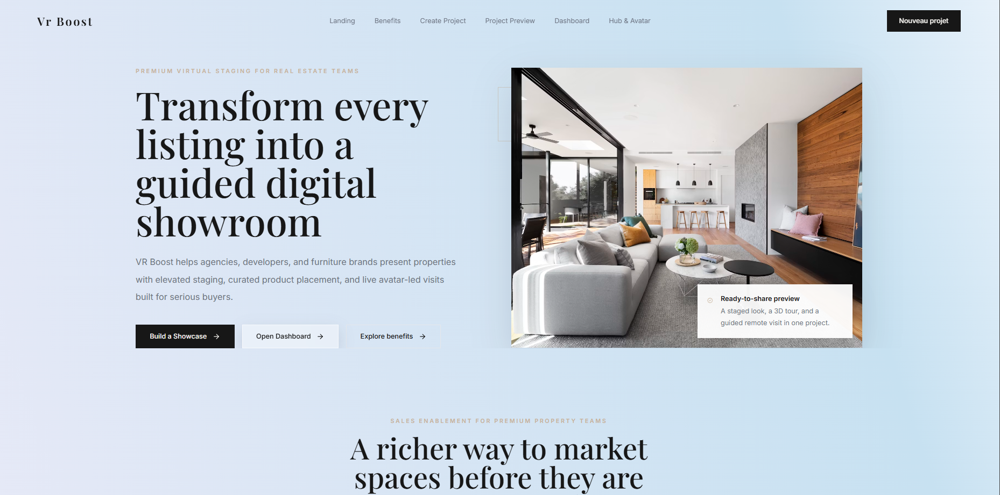
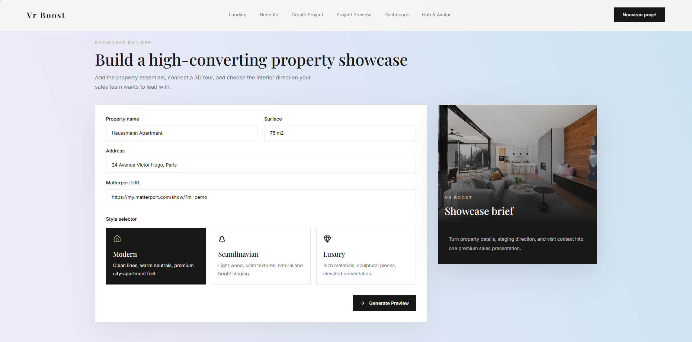
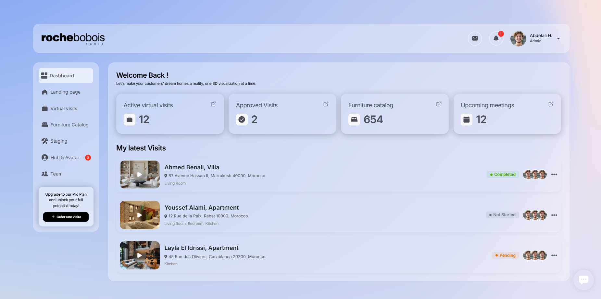

# VR Boost — Virtual Home Staging Platform (Front-End Prototype)

VR Boost is a front-end prototype for a virtual real estate staging product. It gives agencies, developers, and furniture brands a way to present a listing as a fully staged, guided digital showroom before the property is move-in ready, photographed, or furnished.

The prototype covers three experiences: a public-facing landing page that pitches the product and lets a user spin up a mock project, an operations dashboard for tracking visits and listings, and a Hub & Avatar page for guided remote walkthroughs led by a live or virtual host.

This version is intentionally front-end only. There is no backend, database, or authentication — every page runs on static mock data and client-side routing, with the goal of validating the product concept, the user flow, and the visual direction before any infrastructure work begins.

## Screenshots

### Landing Page
The landing page introduces the premium B2B positioning, the main calls to action, and entry points into the dashboard and Hub & Avatar experiences.



### Showcase Builder
The project creation flow lets a user enter property details, attach a Matterport 3D tour URL, and choose a staging direction (Modern, Scandinavian, or Luxury).



### Dashboard
The dashboard gives the agency side of the product a home: visit metrics, recent activity, and navigation into the rest of the app, all wrapped in a glass-panel visual style.



### Hub & Avatar
The Hub & Avatar page is where a guided remote visit actually happens — session overview, live metrics, and avatar presets for hosting a walkthrough.


## Pages

### Landing Page — `/`

- Hero section with primary calls to action
- Benefit sections for home staging, guided visits, agencies, and furniture brand partnerships
- A project creation form (mock) covering property name, surface area, address, and Matterport URL
- A staging style selector (Modern / Scandinavian / Luxury)
- An optional project preview, revealed after clicking "Generate Preview", showing the selected style and a sample furniture set
- Links into the dashboard and Hub & Avatar pages

### Dashboard — `/dashboard`

An operations view for the agency side of the product, built to run standalone in this Vite app with no router or backend dependency. It includes a sidebar, statistics cards, a list of recent visits, and mock user/avatar data, plus navigation back to the landing page and into Hub & Avatar.

### Hub & Avatar — `/hub-avatar`

A front-end-only page styled to match the dashboard, representing the live guided-visit experience: hub session overview, active hub/avatar/message metrics, a featured visit preview, upcoming sessions, and avatar presets.

## Why This Architecture

A few decisions were made deliberately, given the scope of a three-page prototype:

**No React Router.** With only three routes and no nested layouts, a router adds a dependency without adding much value. `App.tsx` instead reads `window.location.pathname` once at render time and switches between the landing page, the dashboard, and Hub & Avatar. This keeps the bundle smaller and the routing logic easy to follow in a single file.

**No backend.** The goal of this stage of the project is to validate the concept and the interaction design, not to build infrastructure. All visits, sessions, avatars, and furniture data are static, which makes the prototype fast to iterate on and easy to demo without any setup beyond `npm install`.

**Shared visual language across pages.** The landing page, dashboard, and Hub & Avatar all draw from the same palette and the same glass-panel pattern, so the product reads as one cohesive system rather than three disconnected screens.

## Tech Stack

- React 18 with TypeScript
- Vite for the build and dev server
- Tailwind CSS for styling
- Framer Motion for entrance animations on the landing page
- Lucide React for icons

## Project Structure

```text
src/
  App.tsx                Landing page, project creation flow, and the path-based route switch
  main.tsx                React entry point
  index.css               Tailwind layers and shared glass/dashboard styles
  components/
    Dashboard.tsx          Dashboard page
    HubAvatar.tsx          Hub & Avatar page
    Navbar.tsx             Landing page navigation
    SectionWrapper.tsx     Reusable landing section wrapper
  data/
    mock-data.ts           Navbar link data
  hooks/
    useInView.ts           Scroll-triggered animation hook
```

## Routing

Routing is handled without `react-router-dom`, by design:

- `App.tsx` reads `window.location.pathname`
- `/dashboard` renders the dashboard
- `/hub-avatar` renders the Hub & Avatar page
- every other path renders the landing page

If the page count grows beyond this, migrating to `react-router-dom` would be the natural next step (see Future Improvements).

## Styling

The product uses a shared, dashboard-inspired palette:

- A soft blue/lavender gradient background
- Charcoal primary text with a muted blue-gray secondary tone
- Glass panels: translucent white surfaces with soft borders
- Blue-gray accents throughout

The palette lives in `tailwind.config.js`, and the shared glass styles live in `src/index.css`. Key utility classes:

- `dashboard-bg` — the shared gradient background
- `glass-panel` — the translucent glass surface
- `glass-panel-strong` — a stronger, "active" glass surface
- `section-padding` — shared horizontal padding for landing page sections

## Getting Started

Install dependencies:

```bash
npm install
```

Start the dev server:

```bash
npm run dev
```

On Windows, if PowerShell blocks `npm.ps1`, use:

```bash
npm.cmd run dev
```

Then open:

```text
http://127.0.0.1:5173
```

## Available Scripts

```bash
npm run dev       # Start the local development server
npm run build     # Build for production
npm run preview   # Preview the production build locally
```

## Routes

```text
/             Landing page
/dashboard    Dashboard
/hub-avatar   Hub & Avatar
```

## Deployment (Vercel)

This is a Vite single-page app with client-side routes (`/dashboard`, `/hub-avatar`). Because Vercel serves files by exact path, a direct visit or a page refresh on one of those routes needs to be redirected back to `index.html` so the app can take over and render the right page.

That rewrite rule lives in `vercel.json`:

```json
{
  "rewrites": [
    { "source": "/(.*)", "destination": "/index.html" }
  ]
}
```

Without this file, Vercel returns `404: NOT_FOUND` on a direct visit to `/dashboard` or `/hub-avatar`.

## Current Scope

- Dashboard and landing images are loaded from external URLs (Builder.io and Unsplash respectively) rather than local assets
- All project, visit, avatar, and session data is static/mock
- There is no authentication, persistence, or API layer yet — this is a visual and interaction prototype, not a production build

## Future Improvements

- Introduce a real router (`react-router-dom`) if the page count grows
- Replace external mock images with local, optimized assets
- Connect the project creation flow to a real backend
- Add authentication for dashboard access
- Persist visits, sessions, avatars, and the furniture catalog through an API
- Expand responsive QA across a wider range of mobile screen sizes